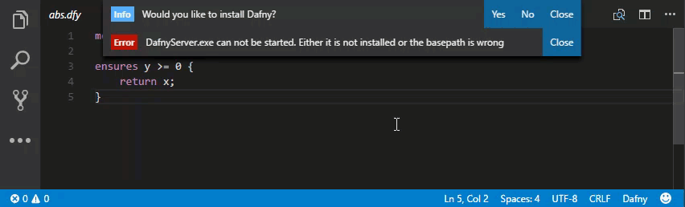
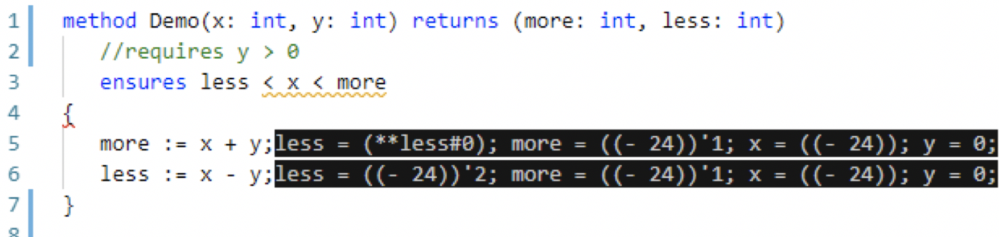
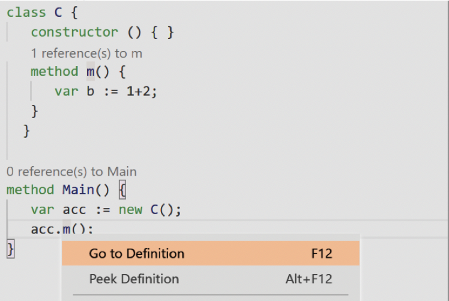

# Dafny for Visual Studio Code

This extension adds _Dafny_ support to Visual Studio Code.
This VSCode plugin needs the Dafny language server, which is placed in a [separate git repository](https://gitlab.dev.ifs.hsr.ch/dafny-ba/dafny-language-server). 

## Features

* **Compile and run `.dfy` files.**
* **Automatic verification as one types.**
  * Errors, warnings and hints are shown through the VSCode interface.
  * When there are no errors, you get a 👍 on the status bar.
* **Syntax highlighting** thanks to [sublime-dafny](https://github.com/erggo/sublime-dafny). See file `LICENSE_sublime-dafny.rst` for license. 
* **Display counter example** for failing proof.
* _IntelliSense_ for classes and _CodeLens_ showing method references.

You can find [more Examples below](#examples).

## Shortcuts

| Shortcut                  | Description                                                          |
| :------------------------ |:-------------------------------------------------------------------- | 
| `Ctrl+Shift+B` or `⇧+⌘+B` | Compile `.dfy` file to `.dll` or `.exe`, if there is a `Main` method |
| `F5`                      | Compile and run, if the source file has a `Main` method              |
| `F7`                      | Show _CounterExample_                                                |
| `F8`                      | Hide _CounterExample_                                                |

## Tasks

Choose `Tasks -> Run Task...` to run one of the following:

| Task                    | Description                                                                               |
| :---------------------- |:----------------------------------------------------------------------------------------- | 
| `Restart DafnyServer`   | Restarts the _DafnyServer_                                                                |

## Requirements

* The plugin needs a _.NET_ runtime to run the _DafnyServer_. If you are not on Windows, please download a distribution from [Mono](http://www.mono-project.com).
  * Note: When you first open a _Dafny_ file, the extension will prompt you to automatically install _Dafny_ and Mono.
* In case you would like the plugin to use a different _Dafny_ distribution, set the path to the `DafnyServer.exe` file via the `dafny.languageServerExePath` user setting.

## Extension Settings

| Setting          | Description                              | Default          |
| :--------------- |:---------------------------------------- |:---------------- |
| `dafny.languageServerExePath` | Relative path to the _Dafny_ language server executable (`DafnyServer.exe`). | |
| `dafny.compilationArgs` | Optional array of strings as _Dafny_ compilation arguments. | |
| `dafny.monoExecutable` | Mono executable with absolute path. Only necessary if mono is not in system PATH (you'll get an error if that's the case). Ignored on Windows when `useMono` is `false`.  | |
| `dafny.useMono` | Only applicable to _Windows_! Requires _.NET_ 4.5 or higher when set to `false`. | `false` |
| `dafny.automaticVerification` | Verify as soon as the document is changed. When `false`, only verify on save. | `true` |
| `dafny.automaticShowCounterModel` | Show _CounterModel_ automatically if a proof fails. Might cause performance issues if `true`. | `false` |
| `dafny.automaticVerificationDelayMS` | Delay in ms to wait after a document change before verifying document. This avoids syntax errors while typing. Only relevant if `automaticVerification` is `true`. | `700` |

## Examples

### Installation
On the first start the plugin asks you to install _Dafny_ automatically. 

### Syntax Error Underlining

Whenever a postcondition statement does not hold, the user will be informed.

### Compile and Run
Pressed `F5` to compile and run the program.

### Show Counter Example
Pressed `F7` to show counter examples.

### Auto Completion
Pressed `control + space` to show auto completion suggestions.

### Go to Definition
Pressed `control + space` to show auto completion suggestions.

Press `F12` to jump to the definition. 

### Add null check (coming soon) 
Some diagnostics can be directly inserted with a quickfix at the beginning of a line.

## Contribute

This is a MIT licensed open-source project that lives from code contributions. All contributors are listed in our [project readme](https://github.com/DafnyVSCode/Dafny-VSCode#contributors).

We welcome your help! For a description of how you can contribute, as well as a list of issues you can work on, please visit the [Dafny-VSCode GitHub repository](https://github.com/DafnyVSCode/Dafny-VSCode#contribute).
