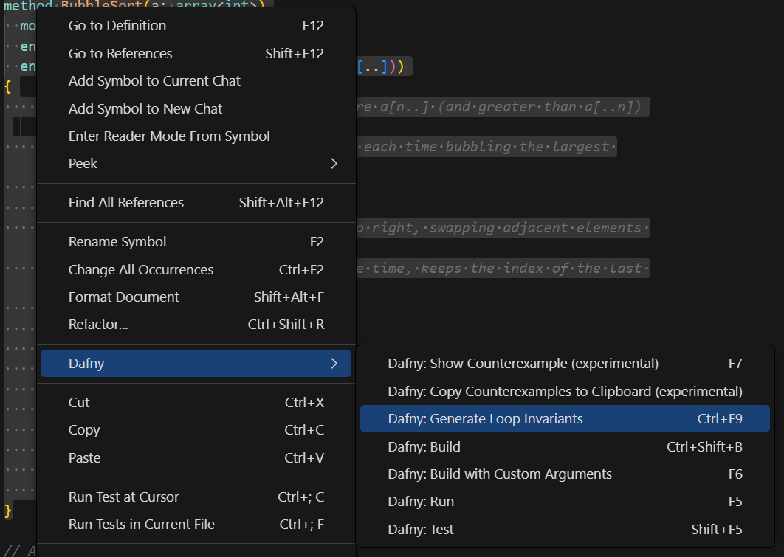

# Dafny for Visual Studio Code

This extension supports Dafny version 3 and beyond. If you require _Dafny 2_ support, consider using the [legacy extension](https://marketplace.visualstudio.com/items?itemName=correctnessLab.dafny-vscode-legacy).

## Features

- **Compile and Run** `.dfy` files.
- **Verification** as one types.
- **Syntax highlighting** thanks to [sublime-dafny](https://github.com/erggo/sublime-dafny). See file `LICENSE_sublime-dafny.rst` for license.
- Display **counterexample** for failing proof.
- **IntelliSense** to suggest symbols.
- **Go to definition** to quickly navigate.
- **Hover Information** for symbols.
- **Generate Loop Invariants** using AI.

### Generate Loop Invariants

To generate loop invariants using AI:

1. Select the portion of code containing the loop you want to add invariants to.
2. Right-click to open the Dafny context menu.
3. Choose "Generate Loop Invariants" from the menu, or use the shortcut `Ctrl+F9`.

This feature helps you automatically add appropriate loop invariants to your Dafny code, potentially saving time and reducing errors in complex proofs.

## Shortcuts

| Shortcut                  | Description                                                       |
| :------------------------ | :---------------------------------------------------------------- |
| `Ctrl+Shift+B` or `⇧+⌘+B` | Compile to `.dll` or, if there is a `Main` method, to `.exe` file |
| `F5`                      | Compile and run, if the source file has a `Main` method           |
| `F6`                      | Compile with custom arguments                                     |
| `F7`                      | Show _Counterexample_                                             |
| `F8`                      | Hide _Counterexample_                                             |
| `Ctrl+F9`                 | Generate Loop Invariants                                          |

## Requirements

The plugin requires at least .NET Core 5.0 (the ASP.NET Core 5.0 or 6.0 runtimes to be more specific) to run the _Dafny Language Server_. Please download a distribution from [Microsoft](https://dotnet.microsoft.com/download).
When you first open a _Dafny_ file, the extension will prompt you to install .NET Core manually. The language server gets installed automatically.

## Examples

Here are a few impressions of the features.

### Installation

1. Uninstall the original Dafny VSCode extension:

   - Open VS Code
   - Go to the Extensions view (Ctrl+Shift+X or Cmd+Shift+X on macOS)
   - Search for "Dafny"
   - Find the original Dafny extension
   - Click on the gear icon next to it and select "Uninstall"

2. Install the new Dafny extension using the VSIX file:

   - Download the latest `.vsix` file from the [releases page](https://github.com/emantrigo/dafny-plugin/releases) of this repository
   - In VS Code, go to the Extensions view
   - Click on the "..." menu (More Actions) at the top of the Extensions view
   - Select "Install from VSIX..."
   - Navigate to the downloaded `.vsix` file and select it
   - VS Code will install the new Dafny extension

3. Restart VS Code to ensure the new extension is properly loaded

After installation, you can start using the new Dafny extension with all its features.

4. Configure AI settings for generating loop invariants:
   - Open VS Code settings (File > Preferences > Settings or Cmd+, on macOS)
   - Search for "Dafny" in the settings search bar
   - Find the "Dafny: AI Provider" setting and choose either "openai" or "claude"
   - Depending on your choice, fill in either:
     - "Dafny: Open Ai Api Key" with your OpenAI API key, or
     - "Dafny: Claude Api Key" with your Claude API key
   - You can also adjust the "Dafny: Number Of Retries" setting to control how many attempts the AI makes to generate loop invariants

After completing these steps, the Dafny extension will be ready to use with AI-powered loop invariant generation.
