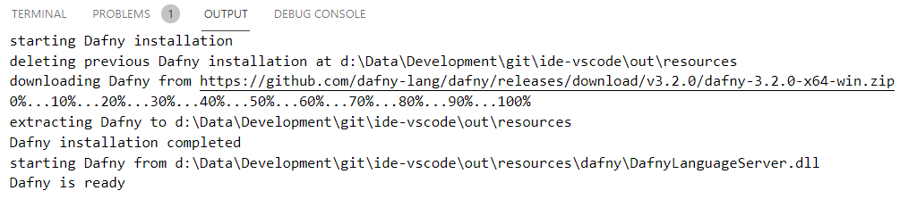
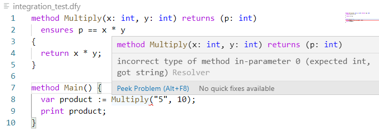
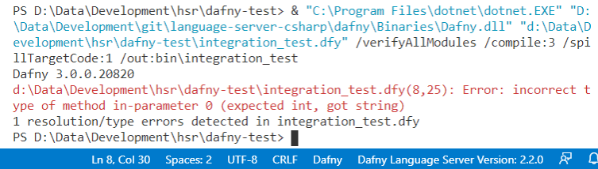
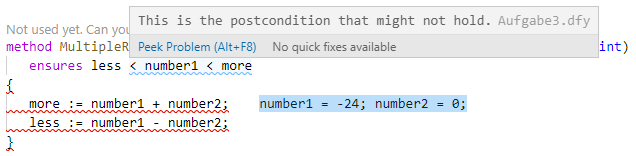
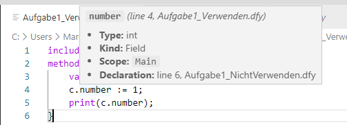
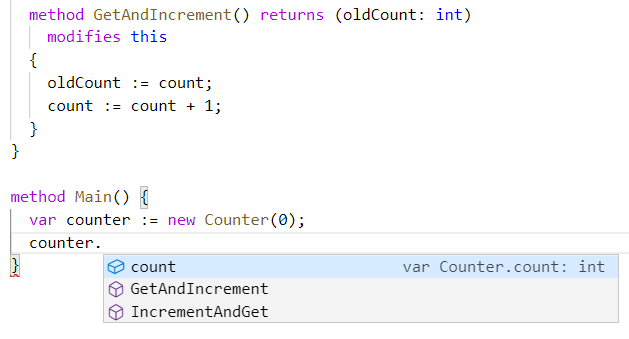
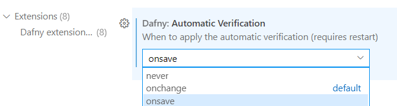

# Dafny for Visual Studio Code

This extension adds _Dafny 3_ support to Visual Studio Code. If you require _Dafny 2_ support, consider using the [legacy extension](https://marketplace.visualstudio.com/items?itemName=correctnessLab.dafny-vscode-legacy).
This VSCode plugin requires the Dafny language server (shipped with the Dafny release since v3.1.0). The plugin will install it automatically upon first use.

## Features

- **Compile and Run** `.dfy` files.
- **Verification** as one types.
- **Syntax highlighting** thanks to [sublime-dafny](https://github.com/erggo/sublime-dafny). See file `LICENSE_sublime-dafny.rst` for license.
- Display **counterexample** for failing proof.
- **IntelliSense** to suggest symbols.
- **Go to definition** to quickly navigate.
- **Hover Information** for symbols.

You can find [examples below](#examples).

## Shortcuts

| Shortcut                  | Description                                                                             |
| :------------------------ | :-------------------------------------------------------------------------------------- |
| `Ctrl+Shift+B` or `⇧+⌘+B` | Compile to `.dll` or, if there is a `Main` method, to `.exe` file                       |
| `F5`                      | Compile and run, if the source file has a `Main` method                                 |
| `F6`                      | Compile with custom arguments                                                           |
| `F7`                      | Show _Counterexample_                                                                   |
| `F8`                      | Hide _Counterexample_                                                                   |

## Requirements

The plugin requires at least .NET Core 5.0 (the ASP.NET Core 5.0 or 6.0 runtimes to be more specific) to run the _Dafny Language Server_. Please download a distribution from [Microsoft](https://dotnet.microsoft.com/download).
When you first open a _Dafny_ file, the extension will prompt you to install .NET Core manually. The language server gets installed automatically.

## Extension Settings

| Setting                           | Description                                                                                                                                                                                        | Default                                                        |
| :-------------------------------- | :------------------------------------------------------------------------------------------------------------------------------------------------------------------------------------------------- | :------------------------------------------------------------- |
| `dafny.languageServerRuntimePath` | Absolute or relative path to the _Dafny_ language server runtime (`DafnyLanguageServer.dll`).                                                                                                      | `null`                                                         |
| `dafny.automaticVerification`     | Optional string to control when the document should be verified (choose between `never`, `onchange`, and `onsave`.                                                                                 | `onchange`                                                     |
| `dafny.verificationTimeLimit`     | Maximum number of time in seconds to verify a document. 0=infinite                                                                                                                                 | `0`                                                            |
| `dafny.verificationVirtualCores`  | Maximum number of virtual cores that may be used for verification. 0=auto (use half of the available cores)                                                                                        | `0`                                                            |
| `dafny.markGhostStatements`       | Mark ghost statements in the code (requires Dafny 3.4.0+).                                                                                                                                         | `true`                                                         |
| `dafny.languageServerLaunchArgs`  | Optional array of strings as _Dafny_ language server arguments.                                                                                                                                    | `[ ]`                                                          |
| `dafny.compilerRuntimePath`       | Absolute or relative path to the _Dafny_ compiler (`Dafny.dll`).                                                                                                                                   | `null`                                                         |
| `dafny.compilerArgs`              | Optional array of strings as _Dafny_ compilation arguments.                                                                                                                                        | `[ "/verifyAllModules", "/compile:1", "/spillTargetCode:1" ]`  |
| `dafny.compilerArgs`              | Optional array of strings as _Dafny_ compilation arguments.                                                                                                                                        | `[ "/verifyAllModules", "/compile:1", "/spillTargetCode:1" ]`  |
| `dafny.preferredVersion`          | The preferred Dafny version to use (overriden by custom compiler and language server paths, choose between `latest`, `3.3.0`, and `3.2.0`).                                                        | `latest`                                                       |
| `dafny.dotnetExecutablePath`      | Absolute path to the dotnet executable. Only necessary if dotnet is not in system PATH (you'll get an error if that's the case).                                                                   |                                                                |
| `dafny.colorCounterexamples`      | Customize the color (HEX) of counterexamples. There are two default colors: for dark theme (#0d47a1, #e3f2fd) and light theme (#bbdefb, #102027). This color setting will override both defaults. | `{ "backgroundColor": null, "fontColor": null }`               |
| `dafny.terminalCommandPrefix`     | The prefix to use when executing a command in the VS Code terminal. Defaults to & on windows.                                                                                                      |                                                                |

Please note that in this new plugin version "automatic verification" is always on and a language server side feature.

## Examples

Here are a few impressions of the features.

### Installation

On the first start, the plugin will install the _Dafny_ language server automatically.



### Error Highlighting



Whenever a syntax, semantic, or verification error is present, the plugin will inform the user.

### Compile and Run

Press `F5` to compile and run the program.



### Show Counter Example

Press `F7` to show counterexamples.



### Hover Information

Hover a symbol to get information about that symbol.



### IntelliSense

Type a dot to get a list of possible members of the accessed symbol.



### Automatic Verification

If VSCode appears unresponsive, you may lower the verification frequency or disable it entirely.



## Troubleshooting

### Stuck at *Verifying...*

Under certain circumstances, the extension appears to be stuck at *Verifying...*. Until now, this has only been observed for Mac OSX and occurs due to a [stack overflow](https://github.com/dafny-lang/dafny/issues/1213#issuecomment-870440082) in the language server.
To overcome this issue, set the environment variable `COMPlus_DefaultStackSize` to a sufficiently large value before starting VSCode. For example:

```sh
# Increase the stack size
export COMPlus_DefaultStackSize=100000

# Launch VSCode
code
```

## Contribute

Dafny for Visual Studio Code is an MIT licensed open-source project that lives from code contributions.

We welcome your help! For a description of how you can contribute, as well as a list of issues you can work on, please visit the [Dafny-VSCode GitHub repository](https://github.com/DafnyVSCode/ide-vscode).

### Building Locally

To build Dafny VSCode locally, first clone this repository.

```sh
git clone https://github.com/dafny-lang/ide-vscode.git
```

Change into the root directory of the previously cloned repository and install the node modules.

```sh
npm install
```

To build and debug using Visual Studio Code, install the [TypeScript + Webpack Problem Matchers](https://marketplace.visualstudio.com/items?itemName=eamodio.tsl-problem-matcher) extension.
After the installation, open the root folder within VSCode and hit `F5` to debug the Dafny extension.

Because the latest version of the plugin requires recent changes to the Dafny language server, you will then need to change the `dafny.compilerRuntimePath` and `dafny.languageServerRuntimePath` extension settings to point to the `Dafny.dll` and `DafnyLanguageServer.dll` files from a local build of Dafny. See [here](https://github.com/dafny-lang/dafny/wiki/INSTALL#building-and-developing-from-source-code) for instructions on building Dafny locally.

### Packaging

To create a VSIX package of the previously built sources, install the [VSCode Extension Manager](https://github.com/microsoft/vscode-vsce) globally:

```sh
npm install -g vsce
```

Now create the package through the CLI:

```sh
vsce package
```

### Coding Conventions

We use ESLint with the TypeScript plugin to ensure code consistency across the whole source. Install the [ESLint](https://marketplace.visualstudio.com/items?itemName=dbaeumer.vscode-eslint) extension in VSCode to have live feedback. Alternatively, you can check your code from the command line by running `npm run lint`.
